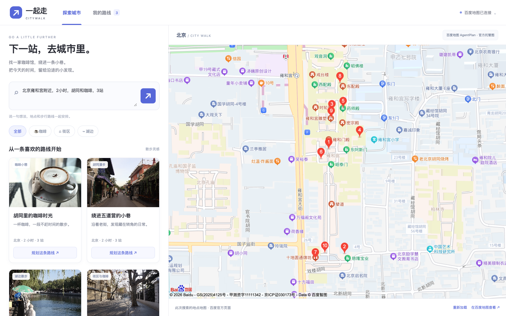

# 一起走 CityWalk Demo

以百度地图为核心的轻量行程规划工具。探索页采用左侧照片卡片、右侧大地图布局；点一次主题卡片，或输入城市、时间和偏好，即可生成真实地点、逐段步行道路与时间预算，也能调整停留和分享只读链接。首版无房间、登录、投票或多人实时编辑。

照片为已注明来源和许可的主题配图，并非生成地点的商户实景。图片及署名位于 `public/photos/`，应用内可查看完整图片来源。



## 本地运行

需要 Node.js 22 或更高版本，无 npm 依赖，无需 `npm install`。

```sh
npm start
```

需要关闭终端后仍在本机运行时，使用 `npm run demo:start` 启动后台服务；再次执行会检查并复用已运行的服务。日志与进程编号保存在 `.data/demo-server.log` 和 `.data/demo-server.pid`。电脑重启后需重新启动，该命令不安装开机服务。

打开 [本地 Demo](http://127.0.0.1:4173)。开发机的 `agentplan` 模式已验证真实地点、步行 API 和只读分享。GitHub 仓库不包含开发机的密钥、CLI 二进制或本地分享数据；新的未配置环境默认使用明确标注的演示模式，可在“我的路线”中使用北京示例点位体验交互。一句话规划与主题卡片需配置 Agent Plan，示意图与示例时间不能作为真实地图验收结果。

编辑器本地草稿存于浏览器，分享快照存于项目 `.data/shares/`。在本机生成的链接只在本机可访问；朋友跨设备访问需要可达服务器，或配置 `HOST=0.0.0.0` 后使用本机局域网地址。此项目尚未公网部署。

## 接入真实百度地图

当前采用 Agent Plan 作为真实数据源：百度账号授权和网页 Token 领取已完成，`npm run baidu:connect` 已通过 CLI 读取现有 SK 并保存到本地私有 `.env`。本轮没有注册传统开发者或创建 AK。无需重复领取或覆盖已有配置，不要将凭证发到聊天或提交 Git。

Agent Plan 通过服务端 Bearer SK 获取真实地点和步行结果，并可使用响应中的 `resource_key` 打开百度官方托管地图。当前账号没有浏览器应用；自有页面加载 JSAPI 底图仍需浏览器 AK。官方托管地图是当前无浏览器 AK 的真实可视化通道，页面搜索、分段道路、时间预算及只读分享已通过真实浏览器验收。

新环境可从配置模板开始：

```sh
cp .env.example .env
```

| 配置 | 用途 |
| --- | --- |
| `CITYWALK_MODE=agentplan` | 当前默认模式，使用真实 Agent Plan 数据 |
| `CITYWALK_MODE=baidu` | 可选传统模式，使用浏览器及服务端 AK |
| `BAIDU_BROWSER_AK` | 浏览器端 AK，用于加载百度地图 JSAPI 4.0 |
| `BAIDU_SERVER_AK` | 服务端 AK，用于地点检索和步行算路 |
| `BAIDU_MAP_AUTH_TOKEN` | Agent Plan SK，仅保留在服务端；与传统 AK 方式分开 |
| `HOST` / `PORT` | 默认 `127.0.0.1:4173`，按本地环境调整 |

传统 AK 模式为可选方案：浏览器 AK 配置实际访问来源，服务端 AK 配置服务权限、额度及网络出口 IP 白名单。当前后端仅实现直接 AK 请求，SN 签名方式需扩展适配器。该模式的搜索使用 Place v2，步行使用 DirectionLite。

配置变更后重新启动 `npm start`，选择相应数据模式并重新搜索真实地点。缺少配置或服务失败时给出明确提示，不静默把示例结果显示为真实结果。

JSAPI 4.0 使用 `BMap` 命名空间，不能与历史版本 `BMapGL` 混用。[官方加载文档](https://lbs.baidu.com/docs/jsapi?title=jsapi4/guide/concepts/load)

## 百度 CLI

本项目已在 macOS arm64 实际安装并运行 `.tools/bmap-cli-darwin-arm64`，核验版本为 `v1.0.1`。

```sh
npm run cli:check
```

CLI 提供账号、AK、配额、样式及 Agent Plan 凭据管理，没有直接搜索或步行算路子命令。本轮已完成账号授权、独立 Agent Plan 网页领取和 CLI 凭据复用；最新只读检查确认现有 Agent Plan SK 可用、浏览器应用列表为空。真实地理请求由 Agent Plan HTTP API 执行。[完整接入记录](docs/CLI接入.md)

`npm run baidu:connect` 只查询并复用现有 Agent Plan SK 和唯一匹配的浏览器 AK，写入本地 `.env`，不输出密钥，也不自动创建或重置资源。多个浏览器应用需先查看当前列表并明确选择；当前响应选择器仅支持已知 `app_type=3`、`ak` 字段，真实结果仍需核对。

## Agent Plan 真实联调记录

真实地点请求已返回 `status=0`、10 个 POI 和 `resource_key`，证据保存于 `.data/agentplan-place-live.json`。真实步行请求已返回 `status=0`、`answer_type=gptmodel_navigate`、道路 `steps.path` 和 `resource_key`；该次路线距离为 654 米、预计 727 秒，证据保存于 `.data/agentplan-direction-no-location.json`。这些是实际百度上游响应；网页已完成真实三站搜索、排序、算路、分段地图和分享：1231 米，步行显示 24 分钟，加停留后显示 84 分钟。

Agent Plan 使用 GCJ02 坐标。官方托管地图地址由真实响应生成：`https://lbs.baidu.com/mapstatic/agentui_resource.html?resource_key=...`，不能虚构资源标识。SK 不能作为 JSAPI 浏览器 AK 使用。

公开 Skill 将路线 `location` 定义为当前位置；本轮使用两个明确地点和 `refer_pois`、省略 `location` 的请求也实际成功。因此 CityWalk 可继续验收选定地点出发的真实步行规划，无需把首站冒充设备当前位置。这一结论来自本次实际响应，尚不代表官方承诺所有请求均可省略该参数；失败或消歧时应明确提示。

## 一句话规划与地图修复

输入“北京雍和宫附近，2小时，胡同和咖啡，3站”，一次生成真实地点、逐段道路和时间摘要；也可直接点“胡同里的咖啡时光”照片卡片。地点选择规则与未核实的营业等信息在折叠详情中。初次打开 Agent Plan 模式会查询真实探索地图，不自动创建或替换行程。

当前本机浏览器直接嵌入百度托管页可能空白。服务只转发完整官方展示文档，iframe 使用另一个 loopback 主机名隔离父页面，并保留官方 SDK 和百度署名。未抽取或复用官方页面的 AK。转发方式仅针对本机 Demo；公开部署需要配置独立展示源或正式浏览器 AK。官方缓存会失效，页面明确提示并提供更新；HTML 加载成功不能证明瓦片全部成功。

## 目录与验证

- `public/` 包含地图编辑页、只读分享页和 Mapus 复用资产。
- `server/` 包含薄后端、百度 Web API 与 CLI 适配器。
- `tests/` 覆盖搜索到分享、快照不变、并发幂等、旧路线拒绝及服务异常。
- `docs/PRD.md` 为 v0.5 产品方案。
- `docs/Demo运行方案.md` 记录实施范围、运行方式和接入步骤。

```sh
npm test
```

42 项自动测试通过，使用演示数据、明确标注的上游 Mock 和脱敏真实响应结构。真实浏览器已验收一句话三站规划、搜索、分段道路、固定分享及 390px 手机布局；跨设备访问及真实手机设备仍待验收。

分享为不可变快照，重新分享生成新链接。分享默认有效 7 天，过期后不能读取。当前使用本地文件存储，尚未配置生产清理任务；公开使用前需要完善数据保留、限额及百度数据授权。

## 开源来源

Mapus 原作者 Alyssa X，MIT 许可。实际复用范围见 `vendor/mapus/SOURCE-BASELINE.md` 和 `public/mapus-assets/`。本项目复用图标和改编缩放控件，重写 CityWalk 业务与百度服务适配，保留相应署名和许可，不把 Firebase 房间系统带入首版。

- [Mapus](https://github.com/alyssaxuu/mapus)
- [百度 JSAPI 4.0](https://lbs.baidu.com/docs/jsapi?title=jsapi4/index)
- [百度 CLI 官方资料](https://github.com/baidu-maps/bmap-cli-skills)
- [Agent Plan 官方发布 Skill 与地图展示](https://clawhub.ai/baidu-maps/skills/baidu-ai-map)
