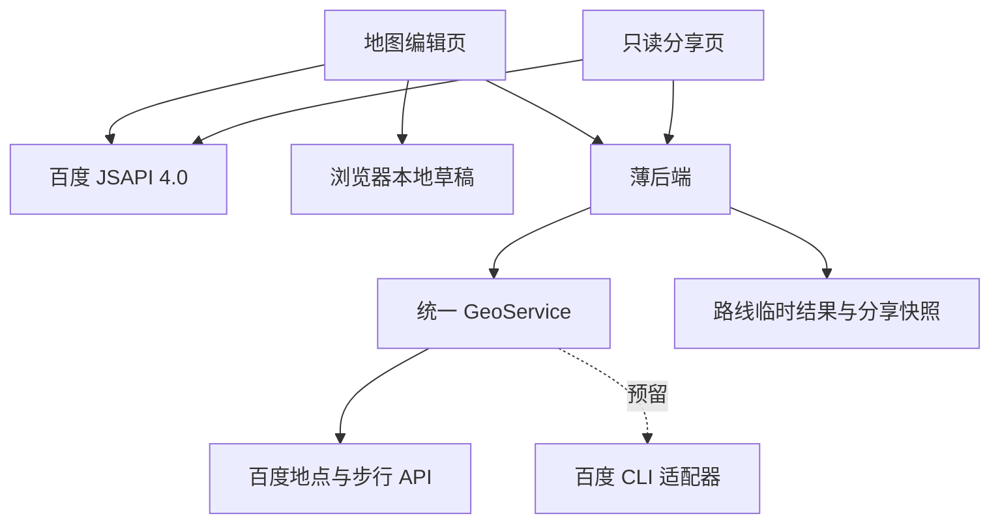

# CityWalk 行程规划与分享 PRD

| 项目 | 内容 |
| --- | --- |
| 工作名称 | 一起走 CityWalk，名称待定 |
| 所属项目 | 百度黑客松 |
| 文档版本 | v0.5 |
| 更新日期 | 2026-09-27 |
| 文档状态 | 已领取 Agent Plan Token，真实地点、地图、三站算路与固定分享已验收，详见 Demo 运行方案 |
| 产品核心 | 百度地图展示、地点检索和真实步行路线 |
| 二开来源 | Mapus，按实际复用内容注明来源 |
| 首版形态 | 独立 Web Demo，适配手机和桌面浏览器 |
| 本轮调整 | 采用用户选定的 Travelwise 布局：左侧照片卡片、右侧大地图，主题卡片一键规划，首次打开获取真实探索地图 |

## 1. 产品立项

### 1.1 我们要做什么

做一个以百度地图为主要界面的 CityWalk 行程规划工具。用户把自己和朋友想去的地点放到地图上，调整游览顺序，查看实际步行距离及预计时间，再分享一份清楚的行程。

第一版由一人整理和编辑行程，朋友通过分享页查看，并在原有聊天渠道提出意见。朋友共创保留为产品发展方向，首版展示单人编辑与行程分享的实际能力。

地图打开后就能搜索和加点，用户无需先创建或加入房间。

### 1.2 为什么值得立项

本项目聚焦一次短时间的同城散步。用户手里可能已有想去的地点，接下来需要知道怎样串联、走多久、每个地方停留多久，以及能否在可用时间内完成。

项目提供的具体价值，是把地点清单、游览顺序、百度步行路线和停留时间放在同一页面。用户调整计划时，可以看到总时间随之变化，并向朋友分享相同的一份结果。

选题与百度地图能力直接相关。地图展示和检索帮助用户找到地点，步行算路帮助判断路线，产品负责把这些信息整理成 CityWalk 行程。百度 JSAPI 支持浏览器地图、覆盖物、检索和路线等能力，可作为本 Demo 的技术基础。[百度 JSAPI 4.0 文档](https://lbs.baidu.com/docs/jsapi?title=jsapi4/index)

这是本次黑客松的立项假设。目标用户是否频繁遇到这些问题、工具能否节省规划时间，仍需通过试用验证；本文不引用未经调查的市场规模、使用率或用户访谈结论。

### 1.3 立项要验证的问题

- 用户能否把零散的想去地点整理成一条可理解的步行行程。
- 加上停留时间后，用户是否更容易判断计划能否在时间预算内完成。
- 分享的地图和顺序清单，是否让朋友更容易理解集合与游览安排。

Demo 成功的标志，是完成一次从搜地点到分享真实路线的完整操作，并让朋友能在另一台设备上看懂行程。

## 2. 目标用户与用户痛点

### 2.1 目标用户

| 用户 | 使用场景 | 核心需求 |
| --- | --- | --- |
| 同城周末出游者 | 想在半天内走几个街区、喝咖啡或去公园 | 把地点串成路线，控制时间 |
| 朋友出游组织者 | 收到朋友想去的地点，需要整理计划 | 集中比较位置和顺序，分享统一结果 |
| 外地短途游客 | 在一座城市有几个小时自由时间 | 看清地点间的步行距离，避免安排过满 |
| 行程查看者 | 收到组织者发来的计划 | 直接看到起点、顺序、路线及预计时间 |

### 2.2 痛点与功能对应

下面是待验证的需求假设，供后续访谈和试用检查。

| 痛点 | 具体表现 | Demo 解决方式 | 可观察的验证信号 |
| --- | --- | --- | --- |
| 地点建议分散 | 朋友在聊天里发了多个店名或地址，组织者需要逐个整理 | 地图上的候选地点清单 | 用户能找到并保存已有建议 |
| 看不出是否顺路 | 地点各自值得去，但放在一起可能绕路 | 编号标记、手动排序及逐段步行路线 | 用户能根据地图调整顺序 |
| 容易低估总耗时 | 只看走路时间，忽略喝咖啡、拍照或逛街的停留 | 步行时间加用户设置的停留时间 | 用户发现超时后能减少地点或停留 |
| 计划表达不清 | 地图截图缺少顺序或时间，朋友需要追问 | 固定版本的只读行程链接 | 查看者能指出起点和下一站 |

### 2.3 典型使用情境

以下是拟定场景，用于 Demo 和用户测试。

周末下午，几位朋友想在同一片城区散步。大家在聊天中提出咖啡店、街区和公园。组织者打开 Demo，找到这些地点，选出三至五站，调整顺序并查看步行路线。加上每站停留时间后，发现计划超过三小时，便减少一站或缩短停留，随后把行程链接发给朋友。

这个场景不要求每个人同时操作地图，也不依赖新的群聊、邀请或账号流程。

## 3. 产品定位与首版边界

### 3.1 以百度地图为核心

首版是接入百度地图 API/SDK 的独立网页。这里的“以百度地图为主”指地图界面、地点数据和步行路线主要使用百度能力；本轮未涉及把功能嵌入百度地图客户端。

用户打开网页直接看到地图，城市选择、搜索和行程清单围绕地图展开。Mapus 提供二开参考，实际界面和交互服务于本次 CityWalk 场景。

### 3.2 最小 Demo 范围

| 首版必做 | 交付内容 |
| --- | --- |
| 百度地图展示 | 地点标记、行程序号、步行路线，地图与清单联动 |
| 搜索并加入地点 | 按城市搜索百度地点，直接加入行程清单 |
| 编辑行程 | 选择停靠点、调整顺序、设置停留时间 |
| 真实步行算路 | 相邻停靠点逐段算路，汇总距离和时间 |
| 时间预算提示 | 展示步行与停留时间，超时后可手动调整 |
| 本地草稿 | 同一浏览器刷新后保留计划 |
| 只读分享 | 保存当前结果，生成独立行程链接 |
| 后端百度接入预留 | 地点和路线统一数据格式，预留 CLI 适配器 |

建议 Demo 使用单城市、最多 5 个停靠点，仅保留一份有序行程清单。数量为待评审配置，主要用于控制接口调用和界面规模。

### 3.3 后续功能

| 优先级 | 功能 | 进入后续版本的条件 |
| --- | --- | --- |
| P1 | 朋友通过行程链接提交地点建议 | 试用发现原有聊天反馈不够方便，再设计简单建议流程 |
| P1 | 百度 CLI 实际接入 | 验证鉴权、输出格式和运行环境后接入受控查询 |
| P1 | 手动地图加点 | 百度检索无法覆盖用户所需地点时增加 |
| P1 | 导出图片、跳转导航 | 核验服务和实现方式后加入 |
| P2 | 自然语言推荐、自动排序 | 核心规划流程通过试用后评估 |
| P2 | 公共路线、打卡与轨迹记录 | 有对应用户需求后另行立项 |

本次 Demo 排除建房、加入房间、成员管理、投票、多人同时编辑、实时光标和视角同步。后续朋友建议围绕行程链接设计，不引入房间产品模型。

## 4. 用户流程和页面

### 4.1 核心流程

1. 输入城市、具体地标、时间和偏好，或选择一个场景。
2. 一次生成真实地点清单、逐段步行道路和建议停留，无需逐站搜索、加入和算路。
3. 在大地图查看道路，在路线清单查看顺序和时间；详情说明选择规则及尚未核实的偏好。
4. 需要时调整停留、换序，或用“加一站”补充地点。换序和加点后重新算路。
5. 点击分享，生成当前行程的只读链接。
6. 朋友在可访问服务的设备打开链接查看，通过原有聊天渠道反馈。

### 4.2 两个页面

| 页面 | 主要内容 | 主要操作 |
| --- | --- | --- |
| 地图编辑页 | 百度地图、城市和搜索、顺序清单、时间摘要 | 加点、删点、排序、算路、分享 |
| 行程分享页 | 固定版本地图、顺序清单、逐段距离、停留与总时间 | 查看、复制链接 |

名称可在分享时填写，草稿阶段使用默认名称。日期和出发时刻暂为选填，未填写时显示预计总耗时即可，减少首次使用的填写步骤。

桌面端参考用户选定的 [Travelwise 设计展示](https://dribbble.com/shots/27336913-Travelwise-Modern-Travel-App-and-Web-Design)：左侧为需求输入、照片卡片及路线清单，右侧大地图保持可见。探索城市与我的路线可切换，规划成功直接进入路线视图。手机端地图在上、规划与卡片在下；排序保留上移、下移按钮。当前无浏览器 AK 的托管图与清单独立展示，清单选中状态不承诺官方地图定位联动。

## 5. 详细功能规则

### F00 一句话规划

- 完整自然语言原文交给百度 AgentPlan Place，默认三站、三小时；支持城市、2–5 站、总时间和每站停留。
- 点名地标优先保留，同片区补足真实地点。明确地标附近查询未返回地标时，最多一次真实同城补查，不冒充设备位置。
- 地点距离用于建议顺序，各段道路、距离与时间以实际百度步行结果为准，不声称全局最优。
- 首次生成即获取地图与路线，可直接分享。失败保留原计划，不返回示例替代；生成时阻止重复提交。
- 偏好、评分、营业和可进入状态尚未逐项核实，在折叠详情说明。展示资源已失效时明确提示，并提供更新地图操作。

### F01 搜索与地点清单

- 搜索按用户主动提交触发，限定在所选城市。
- 结果展示名称、地址和位置来源，只有具备坐标的结果可以加入行程。
- 选择结果后保留百度地点 UID 和明确的坐标类型，同一 UID 重复添加时打开已有地点。
- 搜索结果直接加入有序行程清单，删除地点同时更新地图编号和路线状态。
- 已有地点后切换城市，提示用户清空当前草稿；用户取消时保留原城市和数据。
- 城市探索卡片使用独立授权的主题配图，并提供作者、原作品与许可证入口；主题配图不标作商户实景。地点卡片也注明图片为主题配图。评分、营业时间仅在服务实际返回且具备权限时展示。
- 探索卡片表示城市、主题和时长建议，点击后调用真实规划接口；只有获取完整地点和逐段道路后，才展示为可分享路线。咖啡、街区、湖边筛选只过滤灵感卡片。
- 首次打开 AgentPlan 模式时，查询当前城市的默认探索地点，展示返回的真实地图；此查询不添加停靠点、不修改草稿，也不冒充设备位置。用户的新搜索或规划优先，迟到的默认地图结果不得覆盖它们。

### F02 编辑与本地保存

- 至少 2 个不同停靠点才能生成路线，首版建议上限 5 个。
- 首尾地点分别作为起点和终点，用户手动排序。
- 每站默认停留 20 分钟，可改为非负整数分钟；时间预算默认 180 分钟，可修改。
- 本地草稿保存城市、有序地点、停留时间及预算。相同浏览器刷新后恢复，地图路线重新计算。
- 草稿只在当前浏览器可编辑；清理浏览器数据后无法依靠分享链接恢复编辑权限。
- 首版按当前浏览器单个编辑页设计，多标签页或跨设备编辑属于后续范围。

### F03 路线与时间

百度步行服务基于起终点返回路线、距离和耗时。首版按相邻停靠点调用，再汇总成整份行程。[步行路线文档](https://lbsyun.baidu.com/docs/webapi?title=directionlite%2Fguide%2Fwebservice-lwrouteplanapi%2Fwalk)

- n 个停靠点生成 n−1 个路段。5 个停靠点对应 4 段请求，不采用多点全组合计算。
- 绘制服务返回的道路路径，显示逐段距离与步行时间。
- 预计总时间等于各段步行时间之和，加上所有停靠点的停留时间。内部以秒计算，展示分钟时向上取整。
- 时间超出预算时提示超出分钟数，用户自行删点、换顺序或减少停留。完整路线超时仍可分享。
- 改变停靠点或顺序后，旧路线标为需更新，重新算路后才能分享。只改停留时间或预算时，复用几何路线并重算摘要。
- 算路期间仍可修改清单；只应用与当前路线输入一致的返回结果，防止旧请求覆盖新顺序。
- 部分路段失败时标明失败段，保留计划并提供重试，禁止分享为完整路线。地图加载失败时仍展示已保存清单。
- 步行时间为服务估算，停留时间由用户设置；首版不据此保证商家营业或道路全天可通行。

### F04 分享

- 分享前校验路线完整、地点顺序一致、当前停留时间摘要正确。
- 后端保存当前行程快照，生成不可预测的只读 token。查看者无需注册。
- 分享快照包含名称、城市、地点顺序、停留时间、路线和时间摘要，不包含浏览器编辑会话或私密聊天内容。
- 一个链接固定指向一次分享结果。编辑本地草稿不改变旧链接，重新分享生成新链接。
- 查看者没有写入入口。转发链接意味着其他持链接者也可查看。
- 为控制 Demo 存储，建议分享快照保留 7 天，具体期限在部署前确定并在分享时说明；到期显示已失效。
- 本次 Demo 只提供只读查看。分享页的留言、投票或共同编辑均属于后续设计。

## 6. 后端和百度接入接口

### 6.1 精简架构

前端管理本地草稿和地图交互，薄后端代理百度地点与路线请求，并保存只读分享快照。首版无需维护成员、角色、邀请或实时协作服务。

### 6.2 首版接口契约

以下路径已在本地 Demo 实现。Agent Plan 请求使用服务端 Token，统一返回地点、道路路径和百度官方地图资源。

| 方法与路径 | 作用 | 主要输入和输出 |
| --- | --- | --- |
| POST /api/v1/itineraries/plan | 一句话规划 | request、city、mode；返回真实路线、建议停留、预算和选择说明 |
| GET /api/v1/maps/resource-status | 检查官方资源 | 验证 resource_key；空缓存明确标记 expired |
| GET /api/v1/maps/embed | 转发完整官方展示文档 | 固定官方域名和路径，不改脚本、不读取或转发凭证 |
| POST /api/v1/geo/places/search | 搜索百度地点 | keyword、city、page；返回规范化地点列表 |
| POST /api/v1/geo/routes/walking | 计算有序停靠点路线 | orderedStops、coordSystem、requestId；返回 routeResultId、inputHash、路段与总计 |
| POST /api/v1/shares | 保存当前分享快照 | routeResultId、inputHash、名称、停留时间、预算；返回 shareUrl、expiresAt |
| GET /api/v1/shares/{shareToken} | 读取固定分享结果 | 返回地点、路线和摘要，不返回写入凭证 |

路线临时结果包含有序地点、坐标和来源。inputHash 由有序地点和影响算路的参数产生，分享时前端提交当前值，后端核对路线结果及其指纹，并据此生成几何快照，再根据提交的停留时间计算摘要。前端不能通过伪造总距离或时长替换百度结果。临时结果过期时提示重新算路。

公开网页的地图代理采用短期匿名浏览会话或等效限频机制，不引入注册页面。后端检查参数、调用额度和请求频率，服务端 AK 不下发到浏览器。

### 6.3 API 与 CLI 预留

- GeoService 统一地点与路线数据，不向前端透传供应商原始结构。
- AgentPlanAdapter 承担当前真实检索和算路，百度返回的地图资源用于无浏览器 AK 的展示；传统 Web API 适配器保留。
- BaiduCliAdapter 提供版本和配置能力检查；本地脚本复用 CLI 查询现有 Agent Plan Token 并写入配置。
- CLI 接入后，后端只接受结构化业务参数，执行已允许的操作；前端不提供任意命令入口。
- 已实际验证 CLI v1.0.1、账号授权和凭据读取。CLI 可运行与某次搜索、算路成功分别显示，避免把配置状态当作服务连通状态。
- CLI 账户或 AK 管理属于开发者配置，不出现在游客的产品流程中。

当前安装的官方 CLI 主要提供账号、AK、额度、样式和 Agent Plan 凭据管理；地理搜索和步行规划由 Agent Plan HTTP API 提供。明确站间规划已实测可在精确地点映射下省略当前位置，不索取设备定位、不把第一站冒充用户位置。[官方 CLI 仓库](https://github.com/baidu-maps/bmap-cli-skills)

### 6.4 数据与错误约定

| 对象 | 主要字段 |
| --- | --- |
| Place | placeId、providerPlaceId、name、address、location、source |
| LocalDraft | localId、city、orderedStops、stayMin、budgetMin |
| RouteResult | id、inputHash、orderedStops、segments、distanceM、walkingDurationSec、calculatedAt |
| SharedItinerary | id、tokenHash、stopsSnapshot、routeSnapshot、summary、createdAt、expiresAt |

位置统一使用含 lng、lat、coordSystem 的对象；首版百度数据以 BD09LL 为业务坐标。上游端点的经纬度顺序及参数取值由适配器处理。

地理响应包含 requestId、data、provider、adapterMode、fetchedAt。缺少可选字段时返回 null，不生成营业状态等未返回信息。

错误至少区分参数错误、限频、百度鉴权失败、额度不足、超时、无路线、部分路段失败、结果过期和分享失效。失败后保留草稿，不用演示数据冒充真实返回。重复算路或分享请求使用幂等键，避免重复执行。

后端服务密钥、签名和完整 CLI 命令不进入浏览器或日志。地点数据在分享中的保存和展示范围、缓存期限，需在部署前按所用服务许可确认。

## 7. Mapus 二开处理

Mapus 提供地图标注、地点清单及多人地图工具的二开参考。[Mapus 源仓库](https://github.com/alyssaxuu/mapus)

| 部分 | 本次处理 |
| --- | --- |
| 地图加侧栏交互 | 复用适合的交互或代码，改为 CityWalk 地点和行程清单 |
| 地图底层 | 接入百度 JSAPI，核验标记和路线绘制迁移 |
| 地点搜索 | 通过 GeoService 接入百度检索 |
| 房间、Firebase 多人同步 | 移出本次 Demo，不建立隐藏的房间实体 |
| 自由画线、区域绘制 | 移出首版，行程路线使用真实步行结果 |
| 光标和视角同步 | 移出首版 |
| 时间摘要和分享快照 | 新增 CityWalk 功能 |

二开程度以实际代码复用情况为准。开发前检查选定源码基线，不把 Leaflet 插件直接当作百度插件使用；保留适用的开源许可和作者署名，在参赛材料中说明来源及新增工作。

## 8. Demo 验收和演示

### 8.1 必须通过的验收

| 场景 | 通过条件 |
| --- | --- |
| 直接进入 | 打开后可使用地图和搜索，无建房、加入或注册步骤 |
| 搜索地点 | 可通过真实百度检索找到演示城市的地点并加到地图 |
| 编辑顺序 | 3 至 5 个地点可添加、移除和排序，地图编号一致 |
| 多段算路 | 5 个停靠点获得 4 段真实步行路径，总距离及时间汇总正确 |
| 修改停留 | 摘要更新，几何路线请求不重复执行 |
| 改序遇到旧返回 | 旧路线不能覆盖新输入或用于错误分享 |
| 失败处理 | 额度不足或部分失败有提示，清单保留，不生成伪完整行程 |
| 本地恢复 | 同一浏览器刷新后可恢复地点和编辑数据 |
| 分享查看 | 另一设备能打开只读链接，看懂顺序与时间；无修改入口 |
| 重新分享 | 本地改动不改变旧分享结果，新链接反映新计划 |
| 手机使用 | 搜索、选点、按钮排序及查看路线均可完成 |
| CLI 预留 | 契约和能力配置明确，未接入时不会声称调用成功 |

建议正常网络下，搜索 3 秒内、5 站算路 10 秒内给出结果或明确失败；这些是待实测目标，尚未作为交付时长承诺。

### 8.2 演示脚本

演示只讲一件事，几分钟内把想去的地点整理成一份可分享的 CityWalk。

1. 打开地图，搜索并选择咖啡店、街区和公园等真实地点。
2. 调整顺序，显示百度道路路线和步行距离。
3. 加上停留时间后展示总时间，减少一站或缩短停留，使计划更符合预算。
4. 生成分享链接，在手机或另一个浏览器打开只读行程。

本轮演示城市为北京，雍和宫到五道营胡同的真实接口结果为 654 米、727 秒，后续演示以当次接口结果为准。首版不演示多人同时编辑或投票。

## 9. 立项验证与开发顺序

先验证百度底图、地点搜索和一段步行路线，再完成行程清单及时间摘要，最后增加本地保存与只读分享。CLI 实际运行和其他后续功能不阻塞这条流程。

建议找 3 位实际会组织 CityWalk 的人试用，给出相同的拟定任务，观察能否完成选点、判断超时并分享。重点记录卡住的位置、是否需要解释、朋友能否看懂分享；样本仅用于发现问题，不推断整体市场。

| 指标 | 定义 | 验证用途 |
| --- | --- | --- |
| 规划完成 | 能从地图搜索走到生成完整路线 | 判断主流程是否可用 |
| 耗时判断 | 能解释总时间由步行和停留组成 | 判断时间摘要是否有效 |
| 分享理解 | 查看者能说出起点和游览顺序 | 判断分享表达是否清楚 |
| 路线可靠性 | 有效算路请求的完整成功比例 | 发现服务和数据问题 |

## 10. 参赛要求与待确认事项

用户提供的赛事页面要求百度地图 API/SDK 承担核心功能，并提供可演示 Demo 或视频。此前 2026-09-26 核验的页面显示作品征集至 09.30，具体截止时刻未明确。提交前重新核对要求。[赛事页面](https://lbs.baidu.com/developer/hackathon?s=o1)

本项目用百度地图展示、地点检索和步行算路证明核心服务使用；说明 Mapus 二开来源和新增行程功能。作品名称、团队信息、简介、Demo/视频与 Banner 按表单准备，原创要求按赛事解释核对。

预期完成首版后可使用的简介草案如下，提交前按实际功能修订。

> 一起走 CityWalk 帮助用户把自己和朋友想去的地点整理成步行行程。通过百度地图搜索地点、调整游览顺序，结合真实步行路线与每站停留时间判断总耗时，再分享只读行程。项目以百度地图能力为核心，参考 Mapus 二开，并预留百度地图 CLI 接入接口。

后续需确定产品名称、团队信息和公开演示方式。当前无需传统开发者注册或 AK 即可调用 Agent Plan 并使用官方地图资源；若要在自有 JSAPI 底图上绘制编号与整条多站覆盖物，再配置浏览器 AK。多设备分享仍需可达服务器。

## 11. 来源与文档状态

本地 Demo 已实现行程编辑和分享；本轮领取 Token 并实测 Agent Plan 地点与步行响应。用户痛点和产品价值仍是试用假设，接口连通不等于用户需求已经验证。项目尚未公网部署。

- [百度 JSAPI 4.0](https://lbs.baidu.com/docs/jsapi?title=jsapi4/index)
- [百度步行路线服务](https://lbsyun.baidu.com/docs/webapi?title=directionlite%2Fguide%2Fwebservice-lwrouteplanapi%2Fwalk)
- [百度地点检索](https://lbsyun.baidu.com/docs/webapi?title=placev3%2Fguide%2Fwebservice-placeapiV3%2FinterfaceDocumentV2)
- [百度 CLI 官方仓库](https://github.com/baidu-maps/bmap-cli-skills)
- [Mapus 源仓库](https://github.com/alyssaxuu/mapus)
- [百度地图开发者创作大赛](https://lbs.baidu.com/developer/hackathon?s=o1)
